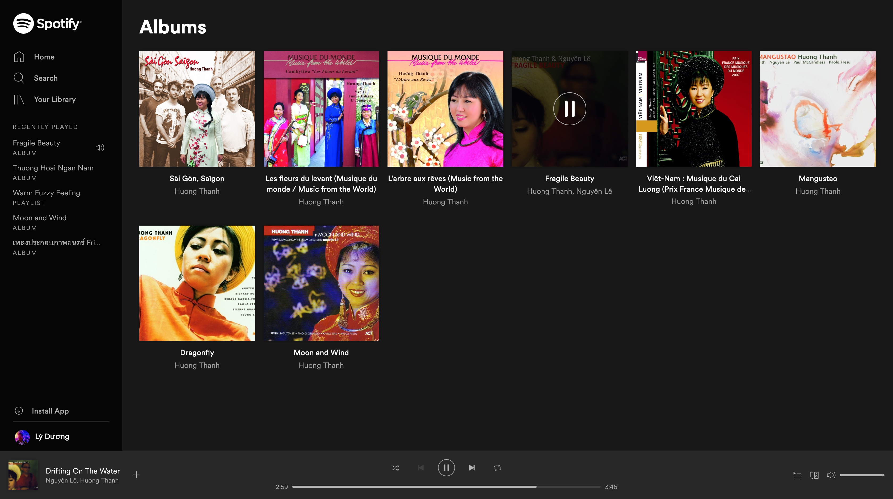
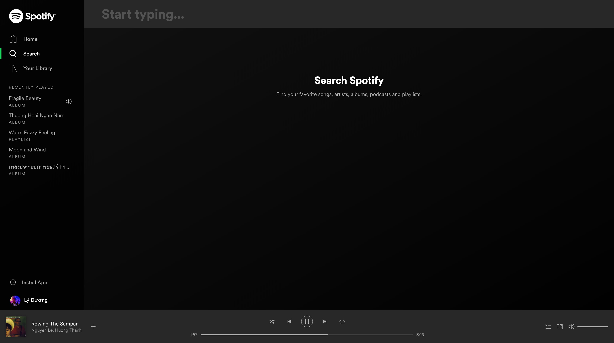

# React Tutorial: Spotify 2

In this tutorial, we'll try to learn to navigate betweeen pages using [React Router](https://reacttraining.com/react-router/web/example/basic). But of course, in order to be able to navigate to another page, we need that "another page"...

So, here we go:

### I. Requirements:

1. Create a list of album page, using this data: https://hailduong.github.io/lyduong/react-assignment/spotify-2/apis/yourLibrary.json

2. Create a search page

2. Read [Route Config](https://reacttraining.com/react-router/web/example/route-config) and setup our app to: 	
	* Clicking the menu item "Your Library", on the left side, would go back to this album listing page. Hint: [Sidebar](https://reacttraining.com/react-router/web/example/sidebar)
	* Clicking on "Search" would navigate to the search page

	
### II. Optional Requirements:

Clicking on each album would:

1. Navigate to that album detail page (we did in the previous assignment). Hint: you may need [query paramerter](https://reacttraining.com/react-router/web/example/query-parameters). 
2. Add that album to the top of the "Recently Play" section. Maxium 5 items.
