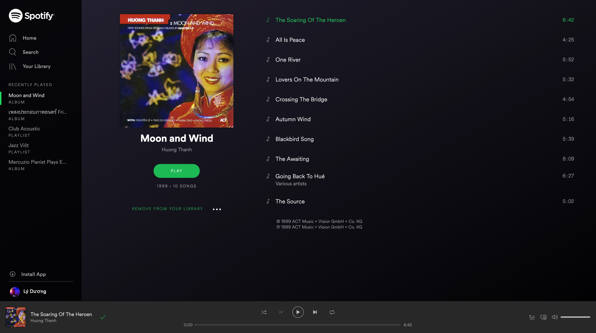

# React Tutorial: Spotify

Please follow this design from Spotify, and create a React App that renders such a page:

### Support content:

#### 1. Data:

- Album: https://hailduong.github.io/lyduong/react-assignment/spotify/apis/album.json
- User info: https://hailduong.github.io/lyduong/react-assignment/spotify/apis/userInfo.json

#### 2. Icons:

You could find nice icons here:
- https://fontawesome.com/v4.7.0/icons/
- https://icons8.com/
- ... or any of your favorite sites

